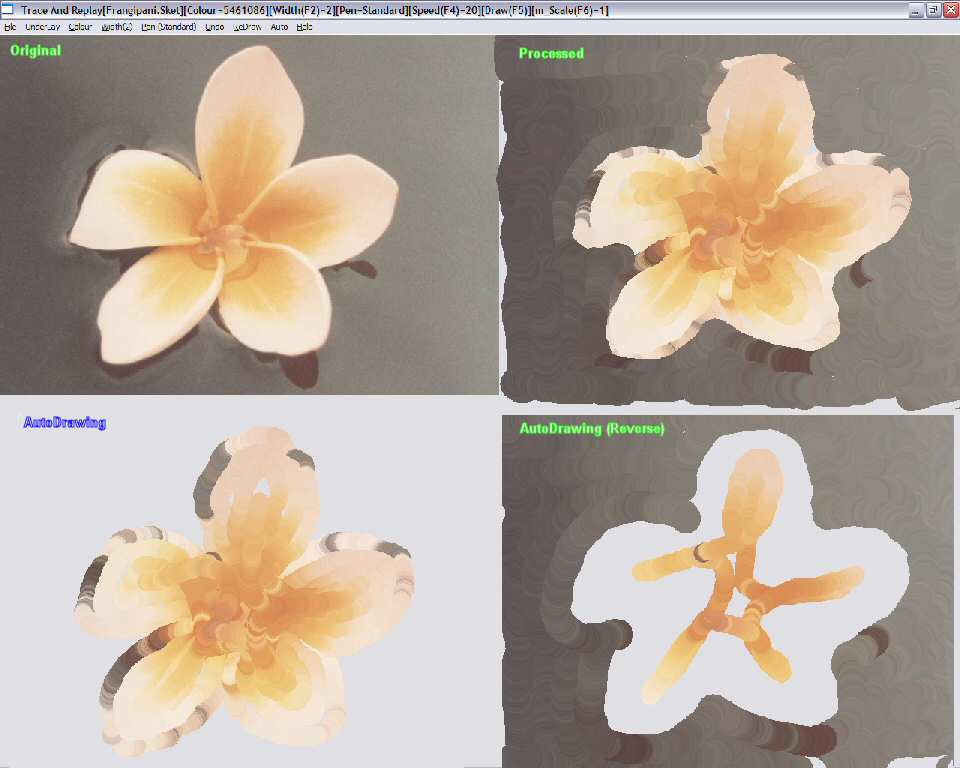



## Trace And Replay 3a \(ClsSketcher\)

### Description

A class that allows you to create animated drawing images.

To use the class all you need is a Form and a CommonDialog control. Menus are optional but useful.

You can either draw your own images or load an existing image and trace it.

----

Tracing can either be with standard pen, where the user selects the colour used or a Duplicate Pen which takes its colour from the underlaying image.

To assist tracing you can either draw directly on the underlying image or offset the trace output to any side of the underlying image.

----

The images are stored in a very simple (and large) file format called 'Sket' which is simply a hex description of the position, drawing phase(Start/Drawing/End), Colour and DrawWidth of a point on the lines you draw. This is a very inefficent file format which I plan to improve as soon as possible (so don't commit yourself to it too deeply)

----

Suggested by Lucim Lack's 'Retrace your Footsteps!' at http://www.Planet-Source-Code.com/vb/scripts/ShowCode.asp?txtCodeId=58084&lngWId=1

----

UPDATE Fixed the save error (accidentally zipped the next to last version))

Added new hotkeys, improved data storage in the Sket file format(unfortunately this means anything you built with version 1 is useless) and added a Scaling method of drawing and some auto sketchers.

----

Also thought of a use for this, and am building a screensaver engine which could use the Sket files as input.

----

NEW NEW NEW NEW 

----

Minor update 'Save' now displays a progress report in caption bar as it can be rather slow if you have large data or high bit colour.

Auto Dash now looks more like pencil strokes (use Width 4-8).
 
### More Info
 

             |
---                |---
**Submitted On**   |2005-01-06 08:54:54
**By**             |[Roger Gilchrist](https://github.com/Planet-Source-Code/PSCIndex/blob/master/ByAuthor/roger-gilchrist.md)
**Level**          |Intermediate
**User Rating**    |5.0 (30 globes from 6 users)
**Compatibility**  |VB 6\.0
**Category**       |[Graphics](https://github.com/Planet-Source-Code/PSCIndex/blob/master/ByCategory/graphics__1-46.md)
**World**          |[Visual Basic](https://github.com/Planet-Source-Code/PSCIndex/blob/master/ByWorld/visual-basic.md)
**Archive File**   |[Trace\_And\_183843192005\.zip](https://github.com/Planet-Source-Code/roger-gilchrist-trace-and-replay-3a-clssketcher__1-58119/archive/master.zip)

